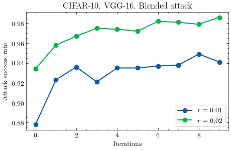

# Data-Efficient-Backdoor-Attacks (PyTorch)

<div align=center>  </div>

[Data Efficient Backdoor Attacks]()

Pengfei Xia, Ziqiang Li, Wei Zhang, and Bin Li, *International Joint Conference on Artificial Intelligence*, 2022.

>Abstract: *Recent studies have proven that deep neural networks are vulnerable to backdoor attacks. Specifically, by mixing a small number of poisoned samples into the training set, the behavior of the trained model can be maliciously controlled. Existing attack methods construct such adversaries by randomly selecting some clean data from the benign set and then embedding a trigger into them. However, this selection strategy ignores the fact that each poisoned sample contributes inequally to the backdoor injection, which reduces the efficiency of poisoning. In this paper, we formulate improving the poisoned data efficiency by the selection as an optimization problem and propose a Filtering-and-Updating Strategy (FUS) to solve it. The experimental results on CIFAR-10 and ImageNet-10 indicate that the proposed method is effective: the same attack success rate can be achieved with only 47% to 75% of the poisoned sample volume compared to the random selection strategy. More importantly, the adversaries selected according to one setting can generalize well to other settings, exhibiting strong transferability.*

## Searching

```python
# Use RSS to create 0.01 * 50000 = 500 poisoned samples on CIFAR-10
python search.py --data_path your_path --data_name cifar10 --ratio 0.01 --n_iter 0

# Use FUS to create 0.01 * 50000 = 500 poisoned samples on CIFAR-10, with the model set to VGG-16, N set to 10, and alpha set to 0.5
python search.py --data_path your_path --data_name cifar10 --model_name vgg16 --ratio 0.01 --n_iter 10 --alpha 0.5
```

## Transferring

```python
# Use the RSS-selected poisoned samples for backdooring a new VGG-13 model on CIFAR-10
python transfer.py --data_path your_path --data_name cifar10 --model_name vgg13 --samples_idx cifar10_vgg16_blended_0_0_0.01_0

# Use the FUS-selected poisoned samples for backdooring a new VGG-13 model on CIFAR-10
python transfer.py --data_path your_path --data_name cifar10 --model_name vgg13 --samples_idx cifar10_vgg16_blended_0_0_0.01_10_0.5
```

## Citation

If you find this work useful for your research, please consider citing our paper:

```
@article{xia2022data,
  title={Data-Efficient Backdoor Attacks},
  author={Xia, Pengfei and Li, Ziqiang and Zhang, Wei and Li, Bin},
  journal={arXiv preprint arXiv:2204.12281},
  year={2022}
}
```
